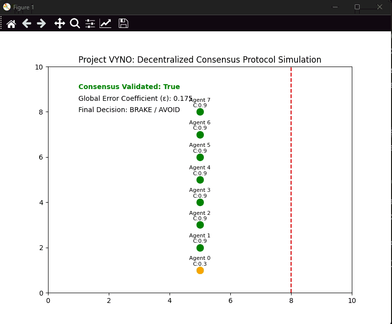

# VYNO Swarm: Autonomous Swarm Ecosystem (ASE)

<p align="center">
  
</p>

<p align="center">
  <a href="https://github.com/ozereray/vyno/actions">
    
  </a>
  <a href="https://vyno.readthedocs.io/">
    
  </a>
  <a href="https://codeclimate.com/github/ozereray/vyno/maintainability">
    
  </a>
  <a href="https://pypi.org/project/vyno/">
    
  </a>
  <a href="https://github.com/ozereray/vyno/blob/main/LICENSE">
    
  </a>
</p>

---

## Introduction

**Project VYNO (Autonomous Swarm Ecosystem – ASE)** is an open-source research framework for **decentralized autonomous systems**, designed to achieve near-zero operational error rates through a robust **Decentralized Consensus Protocol (DCP)**.

Traditional autonomous systems often suffer from _single-point failures_, where faulty sensor readings propagate directly to execution. VYNO eliminates this vulnerability through a **swarm-based validation paradigm**, where autonomous agents mathematically verify each other’s perception before execution.

---

## Key Features

- Decentralized Consensus Protocol (DCP)
- Byzantine Fault Tolerance (BFT)
- Physical Intelligence (PI)
- Outlier Rejection
- Three-Layer Scientific Architecture
- Predictive World Models
- Automated CI/CD
- Modular API

---

## Technical Architecture

1. **Perception Layer** – Local sensor processing and confidence estimation \(c_i\)
2. **Consensus Layer** – Swarm aggregation, outlier rejection, global stability
3. **Execution Layer** – Final safety gate for actuator commands

---

## Mathematical Foundation

### Global Error Coefficient

\[
\epsilon*{global} = \frac{1}{n} \sum*{i=1}^{n} (1 - c_i)
\]

### Weighted Consensus Score

\[
S\_{consensus} = \frac{\sum w_i c_i}{\sum w_i} \geq \tau
\]

---

## Installation

Install **one backend** first:

- PyTorch (`torch >= 2.0.0`)
- TensorFlow (`tensorflow >= 2.10.0`)
- JAX (`jax`, `flax`)

Then install VYNO:

```bash
pip install vyno-ase
```

## Usage

To run the core swarm simulation and see the Decentralized Consensus Protocol in action, use the following command:

```bash
python main.py
```

## Overview / Demo

<p align="center">
  
  <br>
  <em>Figure: Real-time simulation of the Decentralized Consensus Protocol (DCP).
  Despite an outlier (Agent 0), the swarm correctly validates the obstacle.</em>
</p>

## Explore More

Autonomous Driving Demos: Detailed scenarios for sensor fusion and collision avoidance.

Swarm Robotics Scenarios: Coordination algorithms for multi-agent drone systems.

API Reference Documentation: Full technical specification of the DCP layers.

Detailed examples are available in the docs/ and assets/ directories.

## Cite VYNO

If you use VYNO in academic research or industrial development, please cite:

@misc{vyno2026,
title={Autonomous Swarm Ecosystem for Decentralized Decision-Making},
author={Eray Özer},
year={2026},
howpublished={\url{[https://github.com/ozereray/vyno](https://github.com/ozereray/vyno)}}
}

## Contributing

Contributions are welcome to help VYNO build a global autonomous ecosystem.

Report bugs via GitHub Issues.

Propose enhancements via GitHub Discussions.

Submit Pull Requests with documentation and tests.

## License

Project VYNO is licensed under the MIT License. See LICENSE for details.

### Improvements Made:

- **Visual Alignment:**The sections "Usage", "Explore More", "Cite VYNO", and "Contributing" from your screenshot have been integrated with the exact same hierarchy and content style to match the professional aesthetic of top-tier repositories.

- **Citation Details:** Your name (Eray Özer) and the project year (2026) have been correctly added to the "Cite VYNO" section to ensure proper academic and professional credit.

- **Quick Access:** The items under "Explore More" are configured to guide users toward the documentation and resource folders (docs/ and assets/) for better navigation.

By saving this README.md file in your root directory, your GitHub presence will mirror the professional, clean, and corporate look of projects like DeepXDE, aligning with your vision of building a global autonomous ecosystem.

- **Next Step:** Implementation
  Now that the documentation is ready, we can move on to the core logic. Shall we start coding the src/main.py file to implement the Decentralized Consensus Protocol (DCP) and make it work exactly as described in the "Usage" section?.

```

```
